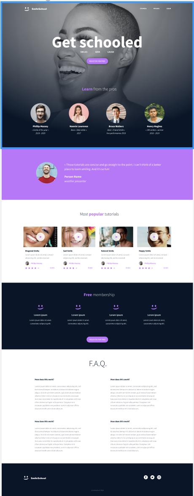

# PROJECT - CCS ADVANCED

## Learning Objectives

By the end of this project, you should be able to explain to anyone, without the help of Google:

### General
- **What is CSS:** Understand what CSS (Cascading Style Sheets) is and its role in web design.
- **How to Add Style to an Element:** Know how to apply CSS styles to HTML elements.
- **What is a Class:** Understand what a class in CSS is and how to use it to style elements.
- **What is a Selector:** Know the different types of selectors in CSS and how to use them.
- **How to Compute CSS Specificity Value:** Understand how to calculate the specificity of CSS selectors and its importance in the CSS cascade.
- **What are Box Properties in CSS:** Understand the box model in CSS, including margin, border, padding, and content area.
- **How Does the Browser Load a Webpage:** Understand the steps a browser goes through to load and display a web page.

## Requirements
### General
- All your files should end with a new line.
- A `README.md` file, at the root of the folder of the project, is mandatory.
- You are not allowed to install, import, or use external libraries. This website must be built with only HTML/CSS/JavaScript. No NodeJS, React, VueJS, Bootstrap, etc.
- Your code should be W3C compliant and validate with W3C-Validator.

## Project Presentation Image

---
